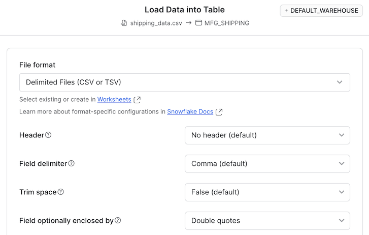
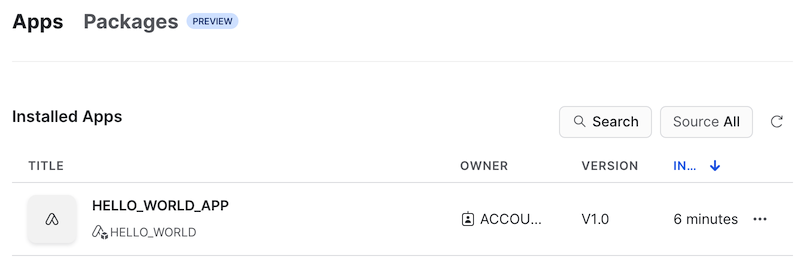
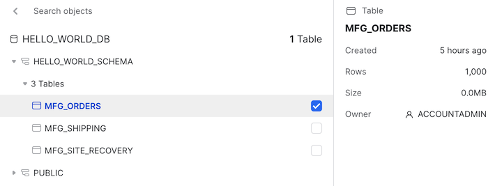

# Snowflake Native App

Playground for trying and learning Snowflake Native App. Based on [Snowflake's official Native App sample code](https://quickstarts.snowflake.com/guide/getting_started_with_native_apps) 
with some modification.

## Snowflake Native App Architecture


## Journal

Here is a journal of how this project was created. This helps us to understand.

1. As of this writing, you can only create Native App on Snowflake running on AWS. So if your account isn't set on AWS, you
   will have to create a Snowflake account on AWS. Go to **Admin** > **Accounts** and click the **+ Account** button
   on the top-right.

1. Create a virtual environment (optional but highly recommended):

   ```bash
   $ python3 -m venv .venv
   $ source .venv/bin/activate
   (.venv) $ # Should see the virtual env name as a prefix the shell prompt
   ```

1. Create subdirectories in the root directory for the app.

   ```shell
   mkdir -p app/data
   mkdir -p app/src
   mkdir -p app/setup
   ```

1. Now that you have a Snowflake account on AWS, log into that account. Navigate to **Apps**. On the top, select 
   **Packages** and then click the **+ App Package**. Enter the following.

   

   Altneratively, we can do add an app package using sql.

   ```sql
   CREATE APPLICATION PACKAGE IDENTIFIER('"HELLO_WORLD"') 
   COMMENT = 'Sample app based on https://github.com/cybersamx/snowflake-native-app.' 
   DISTRIBUTION = 'INTERNAL';
   ```
   
   > **Notes**
   > 1. When we name the new app package we are creating, Snowflake creates a database with the same name. While the 
   >    package name supports whitespace and even special characters, we may want not want to have white space and 
   >    just have uppercase characters in the package name.
   > 1. Enclose the app package name with double quotes  if you include special characters and whitespaces.
   > 1. Make sure we are in the `ACCOUNTADNIM` role for the create package operation. 

1. Run the `app/setup/post_app_create.sql` script to create the pertinent data resources following the app package 
   creation as `ACCOUNTADMIN` role.

1. Create a warehouse if it doesn't exist. Go to **Admin** > **Warehouses** and select **+ Warehouse**. Call it 
   whatever you want eg. `DEFAULT_WAREHOUSE`.

1. Go to **Data** > **Databases** > **HELO_WORLD** > **HELO_WORLD_SCHEMA** > **Stages** > **HELO_WORLD_STAGE** and 
   click **+ Files**. Drop the following files into the UI.

   * `app/manifest.yml`
   * `app/scripts/setup.sql` - make sure to enter `scripts` in the **path** of the pop-up.
   * `app/libraries/*` - make sure to enter `libraries` in the **path** of the pop-up.

   

1. Create a new database and table that the application needs to run. Run the `app/setup/app_instance_setup.sql` file.

   > **Notes**
   > 1. So far, we created 2 databases `HELLO_WORLD` and `HELLO_WORLD_DB`. The difference between the 2 are:
   >    * `HELLO_WORLD` - The management of the app package ie. the code/manifest for installing the app, other 
   >      resources and functions needed to manage the app package.
   >    * `HELLO_WORLD_DB` - The data resources for the app to run. The data for an app instance is stored here.

1. Upload sample data to the new table. Go to **Data** > **Databases** > **HELO_WORLD_DB** > **HELO_WORLD_SCHEMA** > 
   **Tables** > **MFG_SHIPPING** and click **Load Data**, select `data/shipping_data.csv`, select `Double quotes` 
   for `Field optionally enclosed by`.

   

1. Share the shipping data to the consumers of the app package by running `app/setup/share_shipping_table.sql`.

1. Create a new version of the app package. Go to **Apps** > **Packages** > **HELLO_WORLD** and click **Add first 
   version**. Enter `V1` for the version, `HELLO_WORLD` for the database, `HELLO_WORLD_STAGE` as the stage, and `/` 
   as the app directory.

   

   And finally click **Publish app package**.

1. Create tables and upload sample user data (emulate data generated by the consumers of the app package).

1. Create tables to store the data generated by the users of the app package. Run the `app/setup/app_instance_sample_data.sql` 
   file.

1. Upload sample data to the new tables. Go to **Data** > **Databases** > **HELO_WORLD_DB** > **HELO_WORLD_SCHEMA** >
   **Tables**.

   | Target Table        | Sample CSV File               |
   |---------------------|-------------------------------|
   | `MFG_SITE_RECOVERY` | `data/site_recovery_data.csv` |
   | `MFG_ORDERS`        | `data/order_data.csv`         | 

1. Normally, we install an app via the Snowflake Marketplace. Because we are installing the app in the same account 
   that we are developing, we run the `app/setup/install_app.sql`. **Note:** Our warehouse used in the script is 
   `DEFAULT_WAREHOUSE`. Substitute with your warehouse. We should see the following after the running the script.

   

   We may need to assign a warehouse to the app. Also running the app the first time, the app will ask that the user 
   grant `SELECT` privilege to the `Orders` table. Select the right table for this. Do the same for site recovery data.

   

   After this is all done, we should be able to see this.

   

## Troubleshooting

1. I see `Please accept Anaconda terms`.

   If you have multiple accounts, you may switch to the original account (or an account that has `ORGADMIN` enabled). 
   Switch to `ORGADMIN` role. Go to **Admin** > **Billing & Terms** and enable **Anaconda Python packages**.

## Reference

* [Getting Started with Snowflake](https://quickstarts.snowflake.com/guide/getting_started_with_native_apps)
* [Sample Code: Getting Started with Snowflake](https://github.com/Snowflake-Labs/sfguide-getting-started-with-native-apps)
* [More Snowflake demos](https://developers.snowflake.com/demos/analytics-snowflake-native-app/)
* [More advanced Native App on Quickstart](https://quickstarts.snowflake.com/guide/native-app-chairlift/)
